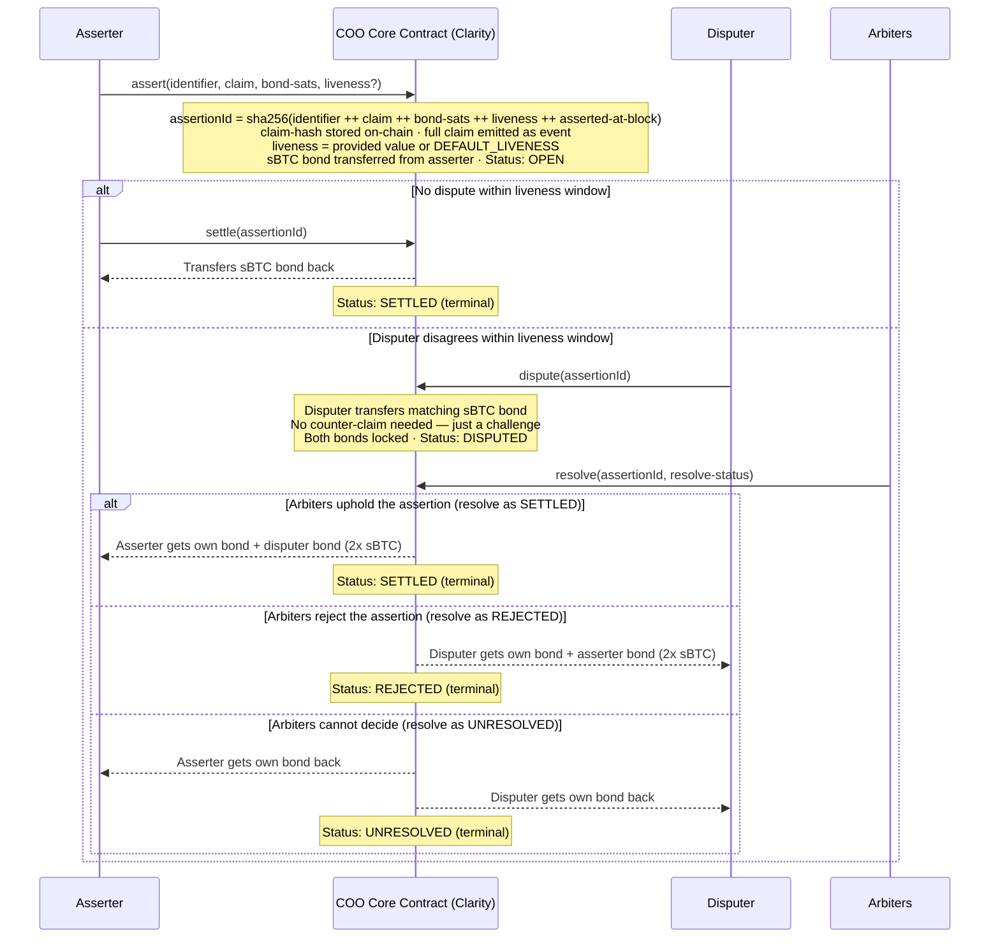
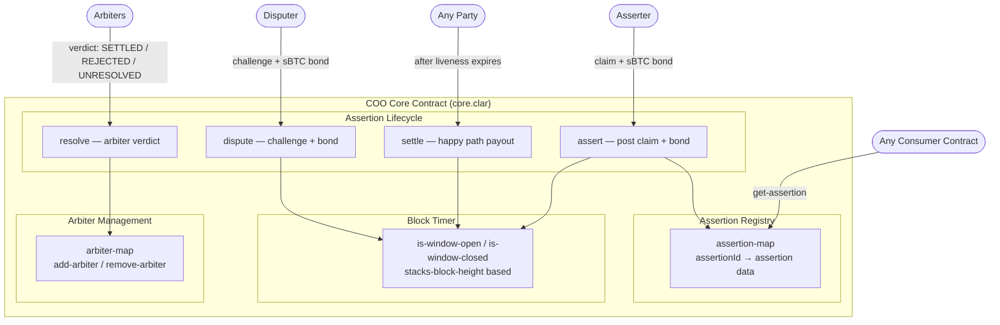
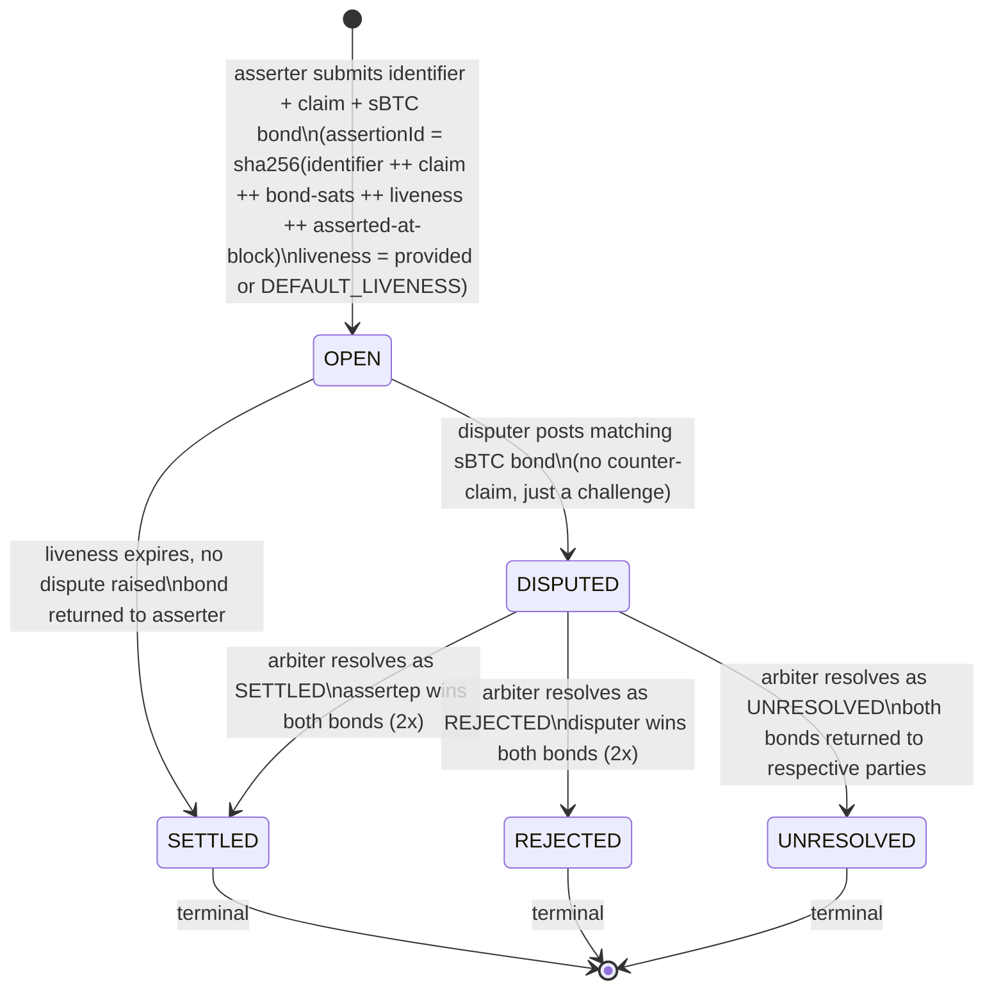

# Clarity Optimistic Oracle (COO)

### A Generic, Trustless Assertion Layer for the Stacks / Bitcoin L2 Ecosystem

---

## The Problem

Blockchains are isolated by design. A smart contract on Stacks has no way to look outside itself — it cannot verify what happened on Solana, what a price was two hours ago, or whether a real-world event occurred. This is called the **oracle problem**.

The naive solution is to trust someone to report the truth. But trust is exactly what blockchains were built to eliminate.

What the Stacks ecosystem currently has are **price feed oracles** — Pyth and RedStone both live on Stacks and do their job well. But a price feed is a narrow tool. It answers one type of question: *"What is the price of X right now?"*

What Stacks does not have is a **general-purpose truth layer** — a system that can answer *any* verifiable question, from any domain, and bring that answer on-chain in a trustless, dispute-resistant way. On EVM chains, UMA's Optimistic Oracle fills this role. It powers Across Protocol, Polymarket, and dozens of other protocols that need off-chain truth without off-chain trust.

Stacks has no equivalent. This project builds one.

---

## What We're Building

**Clarity Optimistic Oracle (COO)** is a generic, permissionless assertion protocol written in Clarity for the Stacks blockchain. Any contract or user can ask a question, any party can answer it by staking a bond, and the answer becomes verified on-chain truth — unless someone disputes it.

The key word is *generic*. COO doesn't care what the question is. It could be:

- *"Did solver 0xABC fulfill intent #42 on Ethereum at block 19,200,000?"*
- *"Was the STX/USD price above $1.50 on March 1, 2026?"*
- *"Did Team A win the championship?"*

Any protocol on Stacks can use COO as its source of truth. It is infrastructure, not an application — the same way UMA is infrastructure that Across is built on top of.

---

## How It Works

The design is deliberately simple. It follows one principle:

> **Assume the claim is true. Punish anyone who lies.**

This is the "optimistic" in Optimistic Oracle. Instead of verifying every claim upfront (which is expensive and slow), the system accepts claims by default and relies on economically incentivized watchers to catch anything false. Because lying costs you your bond, rational actors don't lie.

The lifecycle of every claim moves through the same states:

```
OPEN → SETTLED                 (happy path, ~99% of cases)
     ↘ DISPUTED → SETTLED     (arbiters uphold asserter → asserter wins both bonds)
                → REJECTED    (arbiters uphold disputer → disputer wins both bonds)
                → UNRESOLVED  (arbiters cannot decide → both bonds returned)
```

And the full flow looks like this:



---

## Architecture

COO is implemented as a **single core contract** (`core.clar`) that handles the full assertion lifecycle: submission, settlement, disputes, arbiter resolution, and bond management.



### Core Contract — `core.clar`

**Assertion Registry** — A `define-map` keyed by `assertionId` (a `(buff 32)` derived on-chain). Each entry stores:

```
assertionId → {
  asserter, disputer, claim-hash, bond-sats, liveness, status,
  asserted-at-block, disputed-at-block, settled-at-block,
  rejected-at-block, unresolved-at-block
}
```

Only the `claim-hash` is stored on-chain — the full claim is emitted as a `print` event for off-chain watchers. The `assertionId` is derived by hashing `identifier ++ claim ++ bond-sats ++ liveness ++ asserted-at-block`, so including the block height means the same claim can be re-submitted at a different block and produce a distinct `assertionId`.

**Block Timer** — Uses `stacks-block-height` as the protocol clock. Two read-only helpers (`is-window-open`, `is-window-closed`) check whether the liveness window has expired. Stacks produces fast blocks roughly every 5 seconds, so `DEFAULT_LIVENESS` of 1440 blocks is roughly 2 hours.

**Arbiter Management** — A `define-map` of authorized arbiter addresses. The contract deployer (`CONTRACT_OWNER`) is automatically added as the first arbiter. Only `CONTRACT_OWNER` can add or remove arbiters via `add-arbiter` / `remove-arbiter`.

**Lifecycle Functions:**

| Function | Who can call | Precondition | Effect |
|---|---|---|---|
| `assert(identifier, claim, bond-sats, liveness?)` | Anyone | bond >= MIN_BOND_SATS, no duplicate assertionId | Transfers sBTC bond into contract, stores assertion as OPEN |
| `settle(assertionId)` | Anyone | Status = OPEN, liveness window closed | Returns bond to asserter, status → SETTLED |
| `dispute(assertionId)` | Anyone | Status = OPEN, liveness window still open | Transfers matching sBTC bond into contract, status → DISPUTED |
| `resolve(assertionId, resolve-status)` | Arbiter only | Status = DISPUTED | Distributes bonds per verdict, status → SETTLED / REJECTED / UNRESOLVED |

---

## The Economics

The bond system is what makes honesty the rational choice. All bonds are denominated in **sBTC (satoshis)** — Bitcoin-native collateral that gives every claim real economic weight. The math is simple:

| Scenario | Asserter | Disputer |
|---|---|---|
| Honest claim, no dispute | **bond returned** | — |
| Honest claim, wrongly disputed | **+disputer's bond** | **-bond** (punished for false challenge) |
| Dishonest claim, no watcher | bond returned (exploit — see Future Work) | — |
| Dishonest claim, caught | **-bond** (punished) | **+asserter's bond** |
| Dispute, arbiters can't decide | **bond returned** | **bond returned** |

The protocol enforces `bond >= MIN_BOND_SATS` (currently `u10000` sats) on-chain at `assert()` time. This floor ensures disputes are always economically rational — a disputer knows the minimum they can win is worth the cost of challenging. The protocol doesn't need *everyone* to be honest — it only needs *one* honest disputer, which is a much weaker and more realistic assumption.

---

## Claim State Machine

Every `assertionId` in the system moves through exactly these states, with no exceptions:



**Status constants in code:**

| Status | Value | Meaning |
|---|---|---|
| `STATUS_OPEN` | `u0` | Assertion submitted, liveness window running |
| `STATUS_DISPUTED` | `u1` | Challenged by disputer, awaiting arbiter |
| `STATUS_SETTLED` | `u2` | Terminal — assertion accepted (happy path or arbiter upheld) |
| `STATUS_REJECTED` | `u3` | Terminal — assertion invalidated by arbiter, disputer wins |
| `STATUS_UNRESOLVED` | `u4` | Terminal — arbiter could not decide, both bonds returned |

## What's Intentionally Out of Scope (Hackathon)

These are not oversights — they are honest scope decisions made to ship a working protocol in a hackathon timeframe.

| Skipped for now | Why |
|---|---|
| Separate Truth Store contract | Single contract is simpler; consumers read directly via `get-assertion` |
| Token-based arbiter voting (like UMA's DVM) | Requires a governance token, distribution, and commit-reveal voting — weeks of work |
| Multiple dispute rounds / escalation tiers | Single-round arbiter resolution is sufficient for V1 security model |
| Fee treasury / protocol revenue | Adds token economics complexity; out of scope for infra demo |
| Watcher bot / keeper network | Off-chain component; described in docs but not built |
| Multi-contract architecture | All logic fits cleanly in one contract for V1; can be split later if needed |

---

## Future Work

The hackathon delivers the protocol skeleton. The path from here to production looks like this:

**Near-term (post-hackathon)**

- Replace arbiter resolution with on-chain token voting using a COO governance token or STX stakers — this is the full UMA-equivalent trust model and the default arbitration mechanism
- **Pluggable escalation managers :** Allow per-assertion or per-consumer custom dispute resolution logic via a pluggable interface/traits. When no custom manager is provided, falls back to the default token-vote arbiter system
- **Callback system :** Optional `callback-recipient` per submission — on settlement, COO calls the consumer contract automatically rather than requiring it to poll `get-assertion`. Enables reactive downstream logic such as insurance payouts and bridge releases

---

## Project Identity

| | |
|---|---|
| **Name** | Clarity Optimistic Oracle (COO) |
| **Language** | Clarity 4 (Stacks) |
| **Testnet** | Stacks Testnet |
| **Bond Token** | sBTC (satoshis) |
| **Default Liveness** | 1440 blocks (~2 hrs, at ~5s/block) |
| **Minimum Bond** | `MIN_BOND_SATS` = `u10000` sats |
| **Arbiter Model** | Contract owner managed (hackathon) → Token vote |
| **Target Consumers** | Intent bridges, DeFi protocols, prediction markets, insurance, real-world assets (RWA) |
| **Inspiration** | UMA Optimistic Oracle (EVM) |
| **Positioning** | The missing truth layer for Bitcoin L2, secured by Bitcoin-native collateral |

---

## Clarity 4 Knowledge

This section captures the Clarity 4-specific patterns that directly affect COO's implementation. All contracts in this project target **Clarity version 4** (`clarity_version = 4` in `Clarinet.toml`).

---

### Constant Naming Convention

Clarity constants use `SCREAMING_SNAKE_CASE`:

```clar
;; Protocol parameters
(define-constant DEFAULT_LIVENESS u1440)
(define-constant MIN_LIVENESS u1)
(define-constant MIN_BOND_SATS u10000)
(define-constant CONTRACT_OWNER tx-sender)

;; Status uint constants (Clarity has no enums)
(define-constant STATUS_OPEN u0)
(define-constant STATUS_DISPUTED u1)
(define-constant STATUS_SETTLED u2)
(define-constant STATUS_REJECTED u3)
(define-constant STATUS_UNRESOLVED u4)

;; Error codes — HTTP-style categorization
;; 400 = bad request, 403 = forbidden, 404 = not found, 409 = conflict, 500 = internal
(define-constant ERR_WINDOW_OPEN (err u8400001))
(define-constant ERR_WINDOW_CLOSED (err u8400002))
(define-constant ERR_INVALID_STATUS (err u8400003))
(define-constant ERR_TRANSFER_FAILED (err u8400004))
(define-constant ERR_ASSERTION_BOND_TOO_LOW (err u8400100))
(define-constant ERR_ASSERTION_INVALID_LIVENESS (err u8400101))
(define-constant ERR_NOT_CONTRACT_OWNER (err u8403000))
(define-constant ERR_NOT_ARBITER (err u8403200))
(define-constant ERR_ASSERTION_NOT_FOUND (err u8404100))
(define-constant ERR_ARBITER_NOT_FOUND (err u8404200))
(define-constant ERR_ASSERTION_ALREADY_EXISTS (err u8409100))
(define-constant ERR_ARBITER_ALREADY_EXISTS (err u8409200))
(define-constant ERR_SERIALIZATION_FAILED (err u8500000))
```

---

### `(buff 2048)` — Claim Type

Claims in COO are typed as `(buff 2048)` — a raw byte buffer of up to 2048 bytes. This is preferred over `(string-utf8 N)` for claim data because:

- Claims may contain arbitrary structured data (JSON, ABI-encoded bytes, URLs, hashes) not guaranteed to be valid UTF-8
- `(buff N)` is the idiomatic Clarity type for "up to N bytes of arbitrary data"
- Off-chain watchers read the emitted `claim` bytes and interpret them however the protocol specifies — the contract doesn't need to parse the content

```clar
;; assert() signature — identifier + claim as raw bytes, liveness optional
(define-public (assert
  (identifier (buff 32))
  (claim      (buff 2048))
  (bond-sats  uint)
  (liveness   (optional uint)))
  ...
  ;; store only the claim hash on-chain
  (map-set assertion-map assertion-id {
    claim-hash: (sha256 claim), ...
  })
  ;; emit full assertion data for off-chain watchers
  (print {
    event: "asserted",
    data: {
      assertion-id: assertion-id,
      asserted-by: contract-caller,
      identifier: identifier,
      claim: claim,
      bond-sats: bond-sats,
      liveness: resolved-liveness,
      asserted-at-block: asserted-at-block,
    },
  })
)
```

---

### `assertionId` Derivation

The `assertionId` is a `(buff 32)` derived on-chain by hashing the submission's inputs — the caller never passes it directly. This mirrors how UMA derives its `assertionId` internally using `keccak256`. In Clarity, the equivalent is `sha256`.

**Why derive instead of letting the user pass an ID?**
- Collision detection is automatic: identical inputs at the same block produce the same hash, so a duplicate reverts with `ERR_ASSERTION_ALREADY_EXISTS` without any extra state check
- The ID is deterministic and verifiable off-chain — a caller can pre-compute their `assertionId` before submitting
- Prevents ID squatting: a malicious actor can't reserve an ID for a claim they haven't committed to

**The `identifier` field** is a `(buff 32)` value the asserter defines freely — an intent ID, a market ID, a data feed key, or any meaningful reference. It namespaces the assertion within the caller's protocol. Two assertions with different `identifier` values are always independent, even if their claims are identical.

**Derivation includes `asserted-at-block`:** Unlike UMA which hashes only the claim inputs, COO also includes the current `stacks-block-height` in the hash. This means the same claim with identical parameters can be re-submitted at a different block and produce a distinct `assertionId`, allowing retries after rejection without parameter changes.

**Derivation pattern using `to-consensus-buff?`:**

```clar
(define-private (derive-assertion-id
  (identifier       (buff 32))
  (claim            (buff 2048))
  (bond-sats        uint)
  (liveness         uint)            ;; already resolved from (optional uint)
  (asserted-at-block uint))
  (let (
    (bond-buff (unwrap! (to-consensus-buff? bond-sats) ERR_SERIALIZATION_FAILED))
    (liveness-buff (unwrap! (to-consensus-buff? liveness) ERR_SERIALIZATION_FAILED))
    (asserted-buff (unwrap! (to-consensus-buff? asserted-at-block) ERR_SERIALIZATION_FAILED))
  )
  ;; identifier and claim are already buffs — pass directly into concat
  ;; sha256 over concatenated buffs → (buff 32)
  (ok (sha256 (concat (concat (concat (concat identifier claim) bond-buff) liveness-buff)
    asserted-buff
  )))
  )
)
```

`to-consensus-buff?` returns `(optional buff)` — always unwrap with `ERR_SERIALIZATION_FAILED`. Both `identifier` and `claim` are already `buff` types so they need no conversion and are passed directly into `concat`. The `uint` fields (`bond-sats`, `liveness`, `asserted-at-block`) require `to-consensus-buff?`. Resolve `liveness` to its concrete value (`(default-to DEFAULT_LIVENESS liveness)`) before passing it to this function so the hash is deterministic.

**Liveness validation** must happen before derivation, and only when the caller explicitly provided a value — `DEFAULT_LIVENESS` is trusted and skips the check:

```clar
(let (
  (resolved-liveness (default-to DEFAULT_LIVENESS liveness))
)
  ;; only validate if caller provided a custom liveness
  (and (is-some liveness)
    (asserts! (>= resolved-liveness MIN_LIVENESS) ERR_ASSERTION_INVALID_LIVENESS)
  )
  ;; proceed with derivation using resolved-liveness
  ...
)
```

---

### `restrict-assets?` + `with-ft` — User Paying Into the Contract

When the **user (contract-caller) is the one spending tokens** — posting a bond — use `restrict-assets?` with `with-ft`. This is the Clarity 4 pattern shown in the official Stacks developer quickstart for sBTC transfers.

```clar
;; Pattern: user transfers sBTC into this contract (used in assert() and dispute())
(try! (restrict-assets? contract-caller
  ((with-ft 'SM3VDXK3WZZSA84XXFKAFAF15NNZX32CTSG82JFQ4.sbtc-token "sbtc-token" bond-sats))
  (unwrap!
    (contract-call? 'SM3VDXK3WZZSA84XXFKAFAF15NNZX32CTSG82JFQ4.sbtc-token
      transfer bond-sats contract-caller current-contract none
    )
    ERR_TRANSFER_FAILED
  )
))
```

**Settlement payouts** use `contract-call?` with `current-contract` as sender directly (the contract holds the bonds and transfers them out):

```clar
;; Pattern: contract pays out sBTC (used in settle() and resolve())
(unwrap!
  (contract-call? 'SM3VDXK3WZZSA84XXFKAFAF15NNZX32CTSG82JFQ4.sbtc-token
    transfer bond-amount current-contract recipient none
  )
  ERR_TRANSFER_FAILED
)
```

**Quick rule:**
| Direction | Pattern | Example in COO |
|---|---|---|
| User → Contract (post bond) | `restrict-assets?` + `with-ft` | `assert()`, `dispute()` |
| Contract → User (payout) | `contract-call?` with `current-contract` as sender | `settle()`, `resolve()` |

---

### `tx-sender` vs `contract-caller`

These two keywords look similar but behave fundamentally differently.

| Keyword | Meaning | Changes across hops? |
|---|---|---|
| `tx-sender` | The **original wallet** that signed the transaction | No — always the human |
| `contract-caller` | The **immediate caller** of the current function | Yes — changes each hop |

**COO uses `contract-caller` throughout** — for storing the asserter/disputer identity and for access control:

```clar
;; Storing who asserted/disputed — uses contract-caller
(map-set assertion-map assertion-id {
  asserter: contract-caller, ...
})

;; Arbiter access control — uses contract-caller
(asserts! (is-eq (is-arbiter contract-caller) (some true)) ERR_NOT_ARBITER)

;; Owner access control — uses contract-caller
(asserts! (is-eq contract-caller CONTRACT_OWNER) ERR_NOT_CONTRACT_OWNER)
```

**The phishing risk with `tx-sender`:** If an admin check uses `tx-sender`, a malicious contract can call your function on behalf of an admin. Since `tx-sender` persists as the original signer throughout the entire call chain, the check passes even though it was triggered by the attacker's contract. Always use `contract-caller` for authorization checks.
