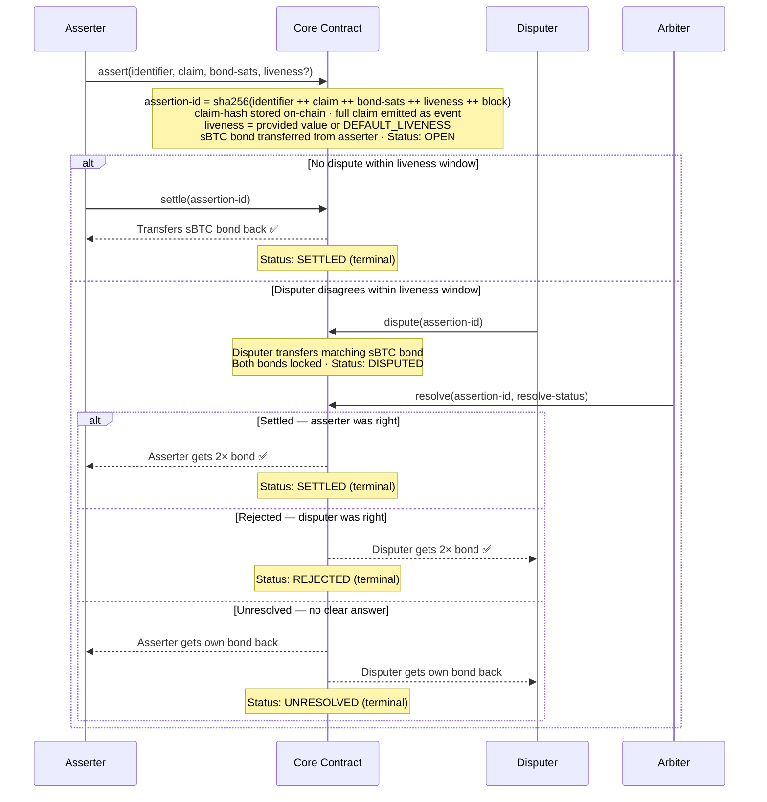
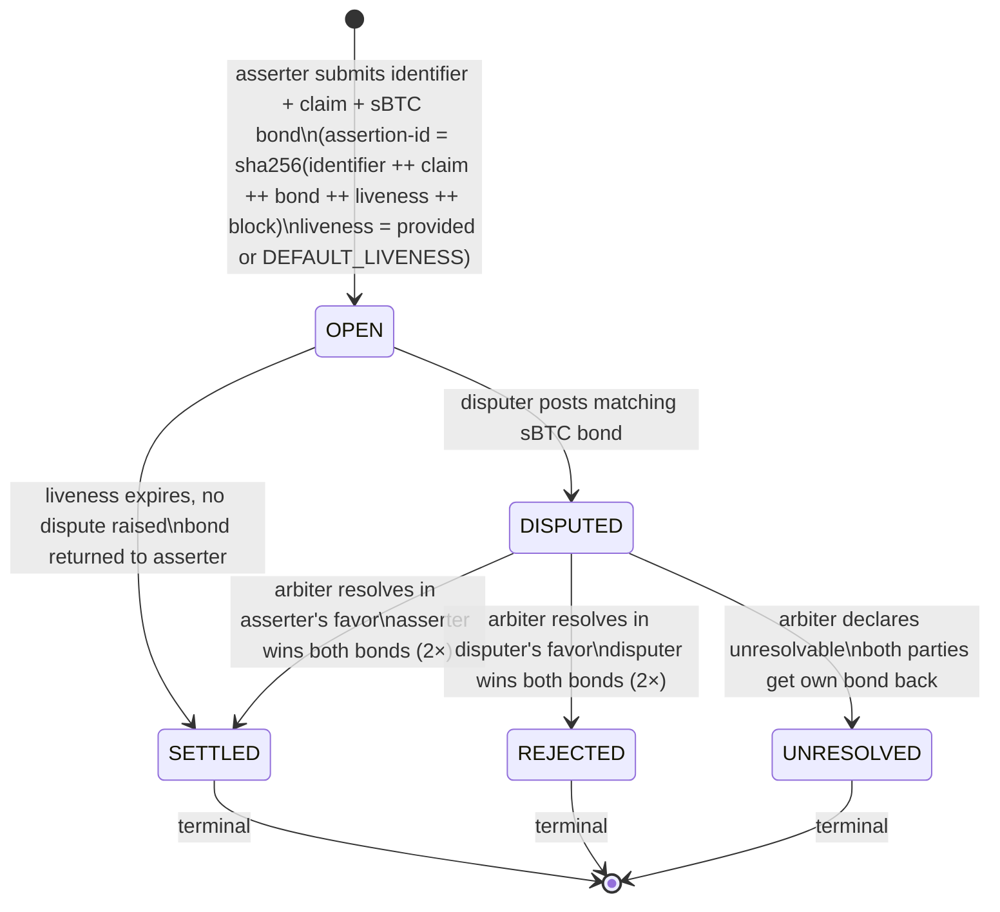

# Architecture

COO is a single Clarity contract (`core.clar`) that owns the full assertion lifecycle.

---

## Data Model

### Assertion Map

Every assertion is stored in `assertion-map`, keyed by a `(buff 32)` assertion ID.

```clarity
{
  asserter:            principal,
  disputer:            (optional principal),
  claim-hash:          (buff 32),
  bond-sats:           uint,
  liveness:            uint,
  status:              uint,
  asserted-at-block:   uint,
  disputed-at-block:   (optional uint),
  settled-at-block:    (optional uint),
  rejected-at-block:   (optional uint),
  unresolved-at-block: (optional uint),
}
```

The full claim is **not** stored on-chain — only its `sha256` hash. The full claim is emitted as a `print` event at submission time for off-chain watchers.

### Arbiter Map

A simple `principal → bool` allowlist. The contract owner (deployer) is the initial arbiter. New arbiters are added or removed via `add-arbiter` / `remove-arbiter`, both restricted to the contract owner.

---

## Assertion ID Derivation

The assertion ID is deterministic — derived from `sha256(identifier ++ claim ++ bond-sats ++ liveness ++ asserted-at-block)`. This makes every assertion content-addressable and prevents duplicate submissions for the same inputs at the same block.

---

## Protocol Parameters

| Parameter | Value | Description |
|---|---|---|
| `DEFAULT_LIVENESS` | 1 440 blocks | ~2 hours at ~5 s/block |
| `MIN_LIVENESS` | 1 block | Floor for custom liveness values |
| `MIN_BOND_SATS` | 10 000 sats | Minimum sBTC bond per assertion |

---

## Public Functions

### `assert`

Submits a new assertion. Transfers `bond-sats` of sBTC from the caller to the contract. Liveness defaults to `DEFAULT_LIVENESS` if not provided.

### `settle`

Settles an open assertion after its liveness window expires with no dispute. Returns the sBTC bond to the asserter. Can be called by anyone.

### `dispute`

Challenges an open assertion within its liveness window. The disputer posts a matching sBTC bond. Both bonds are locked and the assertion moves to `DISPUTED`.

### `resolve`

Resolves a disputed assertion. Restricted to whitelisted arbiters. Three outcomes:

- **Settled** — asserter was right. Asserter receives both bonds (2× bond).
- **Rejected** — disputer was right. Disputer receives both bonds (2× bond).
- **Unresolved** — no clear answer. Each party receives their own bond back.

### `add-arbiter` / `remove-arbiter`

Contract owner manages the arbiter allowlist.

---

## Read-Only Functions

| Function | Returns |
|---|---|
| `get-assertion(id)` | Full assertion tuple or `none` |
| `get-default-liveness` | `DEFAULT_LIVENESS` constant |
| `get-min-bond-sats` | `MIN_BOND_SATS` constant |
| `is-window-open(expiry)` | `true` if `expiry ≥ stacks-block-height` |
| `is-window-closed(expiry)` | `true` if `stacks-block-height > expiry` |
| `is-arbiter(address)` | `(some true)` or `none` |

---

## Events

All state transitions emit `print` events for off-chain indexing:

| Event | Emitted by |
|---|---|
| `asserted` | `assert` — includes full `claim` body |
| `settled` | `settle` or `resolve` (settled path) |
| `disputed` | `dispute` |
| `rejected` | `resolve` (rejected path) |
| `unresolved` | `resolve` (unresolved path) |
| `arbiter-added` | `add-arbiter` |
| `arbiter-removed` | `remove-arbiter` |

---

## Error Codes

Errors follow an HTTP-inspired numbering scheme:

| Code | Constant | Meaning |
|---|---|---|
| `u8400001` | `ERR_WINDOW_OPEN` | Liveness window still open (cannot settle) |
| `u8400002` | `ERR_WINDOW_CLOSED` | Liveness window already closed (cannot dispute) |
| `u8400003` | `ERR_INVALID_STATUS` | Assertion is not in the required status |
| `u8400004` | `ERR_TRANSFER_FAILED` | sBTC transfer failed |
| `u8400100` | `ERR_ASSERTION_BOND_TOO_LOW` | Bond below `MIN_BOND_SATS` |
| `u8400101` | `ERR_ASSERTION_INVALID_LIVENESS` | Custom liveness below `MIN_LIVENESS` |
| `u8403000` | `ERR_NOT_CONTRACT_OWNER` | Caller is not the contract owner |
| `u8403200` | `ERR_NOT_ARBITER` | Caller is not a whitelisted arbiter |
| `u8404100` | `ERR_ASSERTION_NOT_FOUND` | Assertion ID not in registry |
| `u8404200` | `ERR_ARBITER_NOT_FOUND` | Address not in arbiter allowlist |
| `u8409100` | `ERR_ASSERTION_ALREADY_EXISTS` | Assertion ID already registered |
| `u8409200` | `ERR_ARBITER_ALREADY_EXISTS` | Address already an arbiter |
| `u8500000` | `ERR_SERIALIZATION_FAILED` | Internal serialization error |

---

## Claim Flow

```
OPEN → SETTLED                                          (happy path)
     ↘ DISPUTED → SETTLED / REJECTED / UNRESOLVED
```



---

## State Machine

Every `assertion-id` moves through exactly these states:


