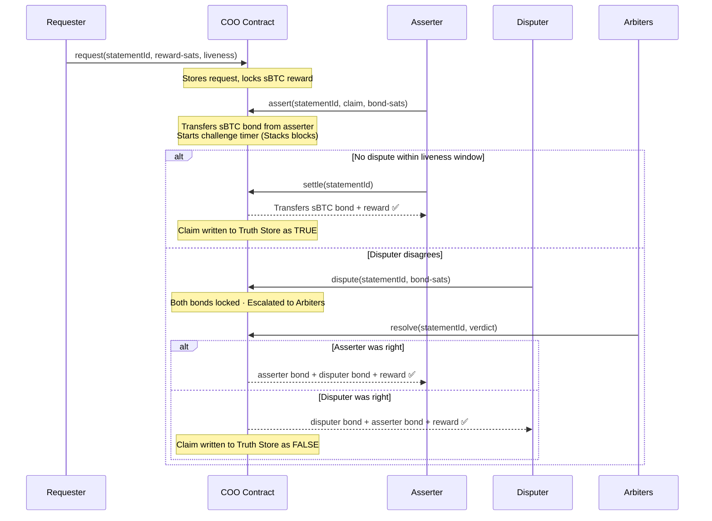
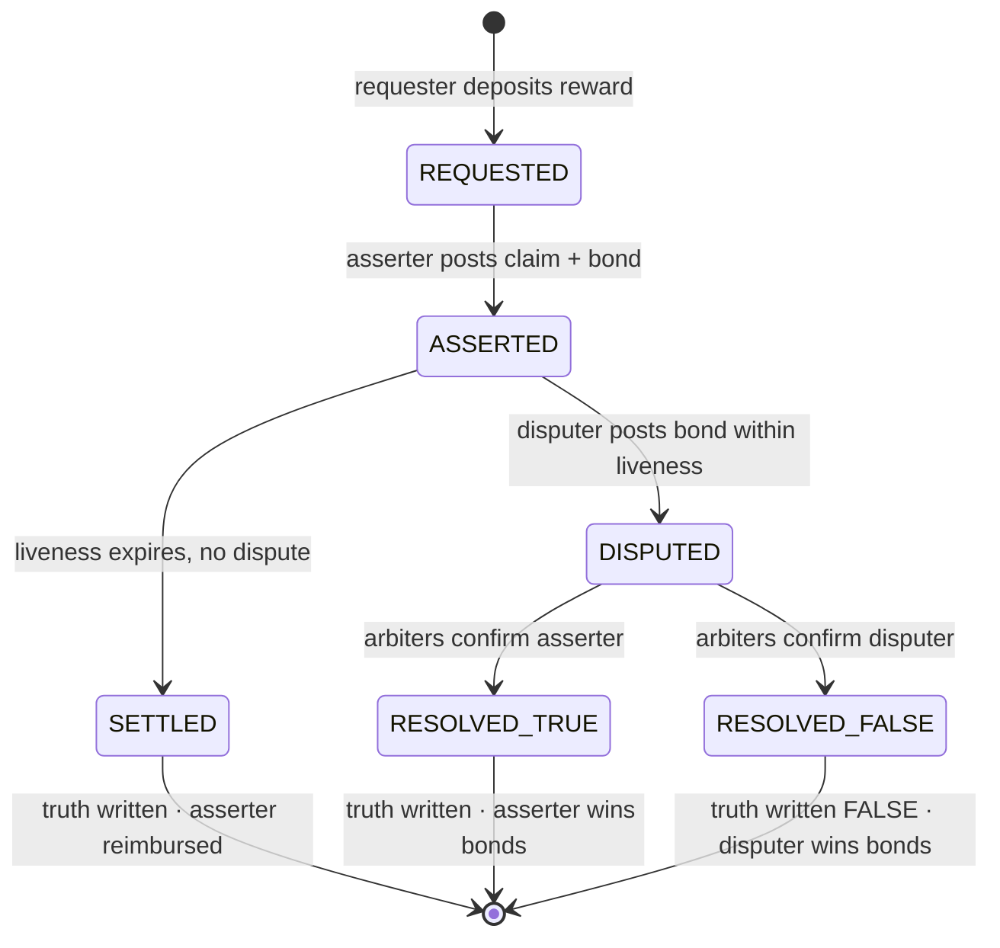

# Architecture

COO is composed of four contracts. Each has a single, well-defined responsibility.

---

## Contracts

### Core — *The Inbox*

Every interaction starts here. Stores two registries and owns the protocol clock.

- **Request Registry** — records who asked a question, the sBTC reward (in sats), and the liveness window (in Stacks blocks)
- **Assertion Registry** — records who answered, what they claimed, and how many sats of sBTC bond they staked
- **Block Timer** — uses Stacks block height as the clock. No external timer, no trusted timestamp. A liveness of 144 blocks is roughly 24 hours.

### Settlement — *The Easy Judge*

Handles the happy path, which is almost every case. When the liveness window expires with no dispute, any party can call `settle`. The contract checks the block height, confirms no dispute flag exists, transfers the sBTC bond and reward to the asserter, and writes the result to the Truth Store.

No governance, no voting, no external calls — just a block check and a token transfer.

### Dispute — *The Hard Judge*

Only activated when someone challenges a claim. The disputer transfers an sBTC bond equal to the asserter's bond into the contract, locking both bonds and flagging the claim as `DISPUTED`. Normal settlement freezes.

**Arbiter Voting** then takes over — a multisig of trusted addresses votes on the correct outcome. Once the threshold is met, slash + reward logic runs: the losing party's bond goes to the winner, the reward is released, and the final result is written to the Truth Store.

### Truth Store — *The Memory*

An append-only map of verified results:

```
statementId → { result, asserter, settled_at_block, disputed }
```

Only writable by the Settlement and Dispute contracts. Readable by anyone. Consumers don't need to understand the rest of the protocol — they call `get-truth(statementId)` and get a verified answer.

---

## Claim Flow

```
REQUESTED → ASSERTED → SETTLED          (happy path)
                     ↘ DISPUTED → RESOLVED_TRUE / RESOLVED_FALSE
```



---

## State Machine

Every `statementId` moves through exactly these states:


