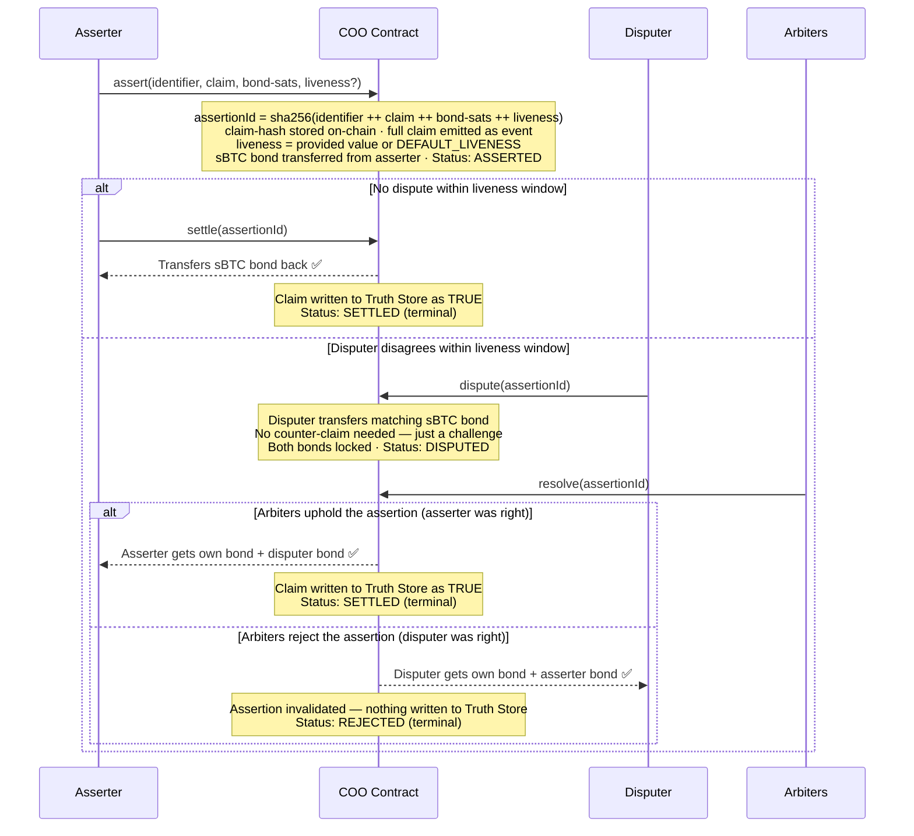
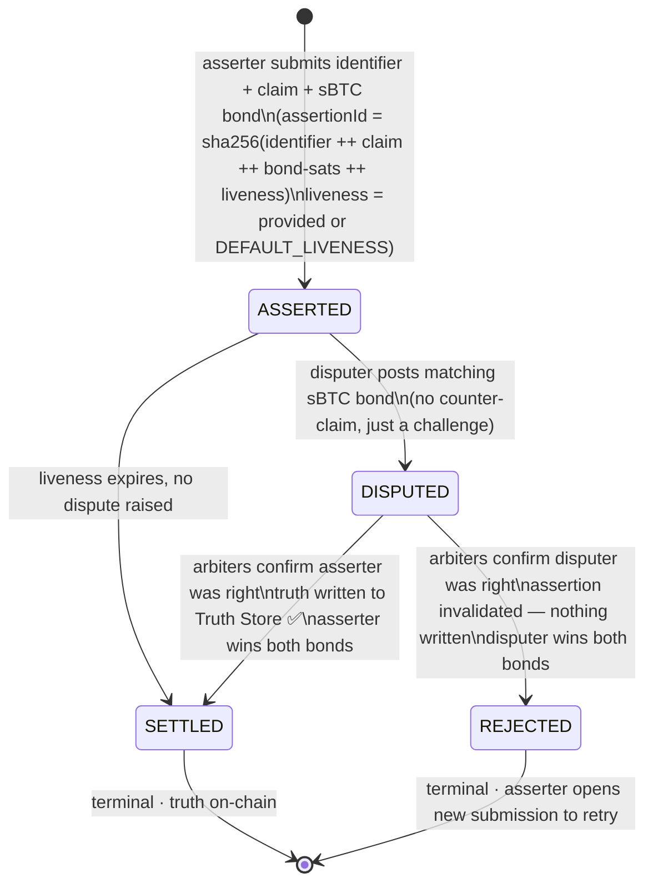

# Architecture

COO is composed of four contracts. Each has a single, well-defined responsibility.

---

## Contracts

### Core — *The Inbox*

Every interaction starts here. Stores the assertion registry and owns the protocol clock.

- **Assertion Registry** — records who submitted a claim, the hash of the claim, how many sats of sBTC bond they staked, and the liveness window. The full claim is not stored on-chain — only its hash. The full claim is emitted as an event at submission time for off-chain watchers.
- **Block Timer** — uses Stacks block height as the clock. No external timer, no trusted timestamp. Stacks produces fast blocks roughly every 5 seconds (independent of Bitcoin's ~10 min block time), so a liveness of 1440 blocks is roughly 2 hours.

### Settlement — *The Easy Judge*

Handles the happy path, which is almost every case. When the liveness window expires with no dispute, any party can call `settle`. The contract checks the block height, confirms no dispute flag exists, transfers the sBTC bond back to the asserter, and writes the result to the Truth Store.

No governance, no voting, no external calls — just a block check and a token transfer.

### Dispute — *The Hard Judge*

Only activated when someone challenges a claim. The disputer calls `dispute(assertionId)` — no counter-claim is provided. The disputer is simply saying *"this assertion is wrong"* and posting an sBTC bond equal to the asserter's to back that challenge. Both bonds are locked and the claim is flagged as `DISPUTED`. Normal settlement freezes.

**Arbiter Voting** then takes over — a multisig of trusted addresses votes on the correct outcome. Once the threshold is met, two outcomes are possible:

- **Assertion upheld** (asserter was right): asserter receives both bonds. Claim written to Truth Store as TRUE. Terminal state: `SETTLED`.
- **Assertion rejected** (disputer was right): disputer receives both bonds. Nothing written to Truth Store. Terminal state: `REJECTED`.

### Truth Store — *The Memory*

An append-only map of verified results:

```
assertionId → { asserter, settled-at-block, disputed }
```

Only writable by the Settlement and Dispute contracts (on the upheld path). Readable by anyone. Consumers call `get-truth(assertionId)` and receive either a verified entry or nothing — never a false positive. Every entry in the Truth Store is guaranteed to be a verified TRUE claim.

---

## Claim Flow

```
ASSERTED → SETTLED                       (happy path)
         ↘ DISPUTED → SETTLED / REJECTED
```



---

## State Machine

Every `assertionId` moves through exactly these states:


